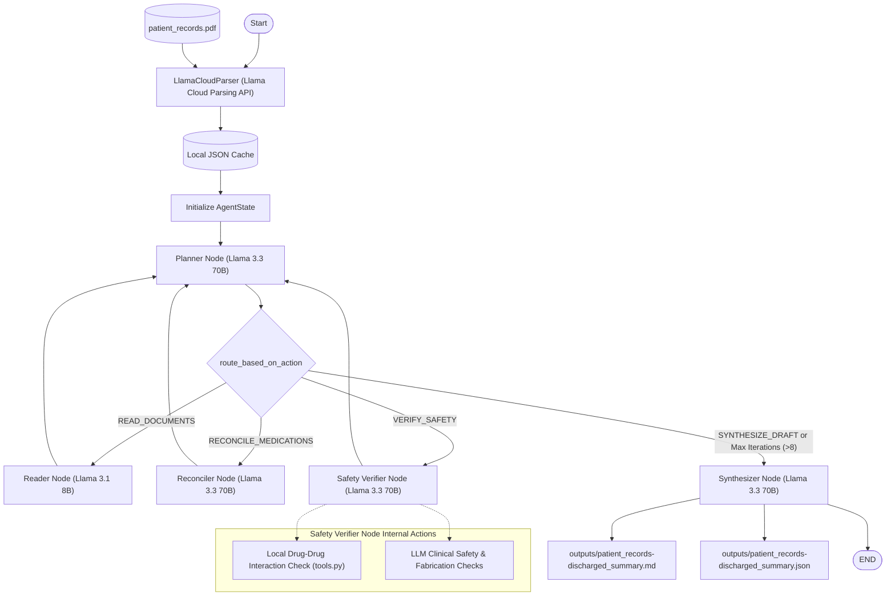

# Clinical Discharge Summary Agentic System

An advanced clinician assistant powered by **LangGraph** and **Groq (Llama 3.3 70B & Llama 3.1 8B)** designed to ingest, parse, reconcile, and compile unstructured patient medical records into structured, safe, and professional clinical discharge summaries.

---

## 📋 Table of Contents
- [System Architecture](#-system-architecture)
- [Key Features](#-key-features)
- [File Structure](#-file-structure)
- [Installation & Setup](#-installation--setup)
- [How to Run](#-how-to-run)
- [Clinical Safety Guardrails](#-clinical-safety-guardrails)
- [Unit Testing](#-unit-testing)

---

## 🏗️ System Architecture

The core of the system is an agentic planning-execution loop built on [LangGraph](https://github.com/langchain-ai/langgraph). The state machine is designed to iterate up to a hard cap of 8 loops, dynamically shifting its focus between reading, reconciling, verifying, and synthesizing. 

- **Reasoning Model (`llama-3.3-70b-versatile`)**: Drives complex orchestration including planning, medication reconciliation, deep safety verification, and final report synthesis.
- **Utility Model (`llama-3.1-8b-instant`)**: Handles high-throughput information extraction inside the Reader Node.

### Workflow Diagram



---

## 🌟 Key Features

1. **Intelligent PDF Visual Layout Parsing**: Uses the `LlamaCloudParser` to extract layout-aware markdown and page numbers from dense clinical records. Implements a local file caching system (`cache/`) to avoid unnecessary cloud API calls and optimize latency.
2. **Dynamic Planner Node**: Evaluates the current state (`AgentState`) at each step, formulates a clinical-decisional plan, and routes to the appropriate worker node (Reader, Reconciler, Safety Verifier, Synthesizer).
3. **Hybrid Model Orchestration**:
   - **Llama 3.3 70B (`llama-3.3-70b-versatile`)**: Hand-selected for orchestrations demanding high clinical reasoning, such as plan coordination, medication discrepancy reconciliation, safety verification, and final report synthesis.
   - **Llama 3.1 8B (`llama-3.1-8b-instant`)**: Utilized in the Reader Node for fast, cost-effective, high-throughput extraction of medical facts from layout-parsed markdown.
4. **Line-by-Line Medication Reconciliation**: Automatically cross-references admission and discharge medication lists against the hospital course narrative. Flags any medication changes (additions, discontinuations, or dosage updates) lacking a documented reason as `HIGH WARNING`.
5. **Clinical Safety Safeguards**:
   - **Local Drug-Drug Interactions (DDI)**: Direct code-level safety screening for critical interactions (e.g., Aspirin + Warfarin, Lisinopril + Potassium, Sildenafil + Nitroglycerin).
   - **No-Fabrication Guarantee**: Strictly prohibits the model from generating dummy demographics or clinical details. Missing fields are explicitly tagged as `[MISSING - Flagged for Clinician Review]`.
   - **Contradiction Resolver**: Scans and flags conflicting details found across clinical progress logs (e.g., contradictory lab/creatinine values).
   - **Clinical Concerns Escalation**: Employs safety warnings for clinical flags (e.g., use of antimotility agents like Loperamide in patients with suspected bacterial gastroenteritis containing blood/pus in stools).
6. **Observability Trace**: Automatically captures reasoning steps, warnings, and plan checklists during execution and saves the trace to `logs/agent_trace.md`.

---

## 📁 File Structure

Clickable links to the project components:

* 📂 **Root Files**
  * 📄 [main.py](file:///home/jerrybritto/demo/AI/clinical_draft_agent/main.py): Application entrypoint. Coordinates document parsing, initial state configuration, LangGraph loop execution, and output file persistence.
  * 📄 [pyproject.toml](file:///home/jerrybritto/demo/AI/clinical_draft_agent/pyproject.toml): Project metadata and library dependencies configuration.
* 📂 **`clinical_agent` Module**
  * 📄 [__init__.py](file:///home/jerrybritto/demo/AI/clinical_draft_agent/clinical_agent/__init__.py): Module initialization and class exports.
  * 📄 [config.py](file:///home/jerrybritto/demo/AI/clinical_draft_agent/clinical_agent/config.py): API key validator and model assignments (Groq's `llama-3.3-70b-versatile` for reasoning tasks and `llama-3.1-8b-instant` for utility/reading tasks).
  * 📄 [graph.py](file:///home/jerrybritto/demo/AI/clinical_draft_agent/clinical_agent/graph.py): Compiles the `StateGraph` using [AgentState](file:///home/jerrybritto/demo/AI/clinical_draft_agent/clinical_agent/state.py) and configures the conditional routing.
  * 📄 [nodes.py](file:///home/jerrybritto/demo/AI/clinical_draft_agent/clinical_agent/nodes.py): Core node functions executing LLM tasks and updating the agent state.
  * 📄 [state.py](file:///home/jerrybritto/demo/AI/clinical_draft_agent/clinical_agent/state.py): Standardizes the `AgentState` type dictionary.
  * 📄 [tools.py](file:///home/jerrybritto/demo/AI/clinical_draft_agent/clinical_agent/tools.py): Local drug-drug interaction matching logic and critical interaction reference database.
  * 📄 [prompts.py](file:///home/jerrybritto/demo/AI/clinical_draft_agent/clinical_agent/prompts.py): System and user instructions for the Planner, Reader, Reconciler, Safety Verifier, and Synthesizer roles.
  * 📄 [parser.py](file:///home/jerrybritto/demo/AI/clinical_draft_agent/clinical_agent/parser.py): Integrates `LlamaCloud` visual parsing API with local caching.
* 📂 **Tests**
  * 📄 [test_clinical_agent.py](file:///home/jerrybritto/demo/AI/clinical_draft_agent/tests/test_clinical_agent.py): Comprehensive unit tests covering DDI lookups, JSON parsing, router endpoints, and parser caching.

---

## ⚙️ Installation & Setup

1. **Activate the Virtual Environment**
   Activate your existing virtual environment:
   ```bash
   source .venv/bin/activate
   ```
   *(Or let the `uv` package manager handle the context execution automatically.)*

2. **Install Dependencies**
   Install all dependencies declared in [pyproject.toml](file:///home/jerrybritto/demo/AI/clinical_draft_agent/pyproject.toml) using the `uv` package manager:
   ```bash
   uv sync
   ```

3. **Configure Environment Variables**
   Create a `.env` file in the root directory (based on the template below) and supply your API keys:
   ```env
   GROQ_API_KEY=your_groq_api_key_here
   LLAMA_CLOUD_API_KEY=your_llama_cloud_api_key_here
   ```

---

## 🚀 How to Run

To run the agentic workflow on the baseline document `data/patient_records.pdf`, run the command:

```bash
uv run python main.py
```

### Generated & Tracked Outputs
* 🔒 **Git-Ignored Generated Outputs**: To prevent tracking patient-specific data, actual output files generated at runtime (e.g., `outputs/*-discharged_summary.md` and `outputs/*-discharged_summary.json`) are ignored by Git.
* 📝 **[outputs/example-discharged_summary.md](file:///home/jerrybritto/demo/AI/clinical_draft_agent/outputs/example-discharged_summary.md)**: A tracked reference example summary showing the typical structure, drug interaction tables, and safety warnings compiled by the agent.
* 🔍 **`logs/agent_trace.md`**: Decisional trace logging explaining every step the planner reasoning loop made (Git-ignored).

---

## 🛡️ Clinical Safety Guardrails

Safety features configured in [verifier_node](file:///home/jerrybritto/demo/AI/clinical_draft_agent/clinical_agent/nodes.py#L252-L350) and [tools.py](file:///home/jerrybritto/demo/AI/clinical_draft_agent/clinical_agent/tools.py):

| Check Category | Implementation Mechanism | Target Safeguard |
| :--- | :--- | :--- |
| **Drug-Drug Interactions** | Code-level DDI matcher mapping key pairs in [tools.py](file:///home/jerrybritto/demo/AI/clinical_draft_agent/clinical_agent/tools.py) | Warns when critical drug combinations (e.g., `Aspirin + Warfarin`, `Lisinopril + Potassium`) are co-prescribed. |
| **Fabrication Prevention** | Strict prompt engineering and State constraints | Forces the system to render `[MISSING - Flagged for Clinician Review]` rather than hallucinating patient demographics or clinical metrics. |
| **Document Conflicts** | Cross-referencing page logs | Detects and flags clinical disagreements in source files (e.g., contrasting laboratory values). |
| **Specific Clinical Contraindications** | Clinical reasoning verification in [VERIFIER_SYSTEM_PROMPT](file:///home/jerrybritto/demo/AI/clinical_draft_agent/clinical_agent/prompts.py#L62-L81) | Prevents inappropriate therapeutic additions (e.g., prescribing antimotility drug Loperamide during active infectious gastroenteritis). |

---

## 🧪 Unit Testing

Run the automated test suite using the `uv` package manager:

```bash
uv run python -m unittest tests/test_clinical_agent.py
```
